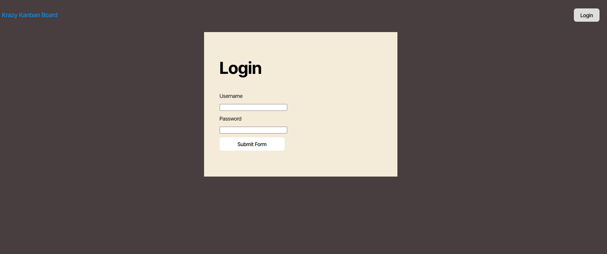
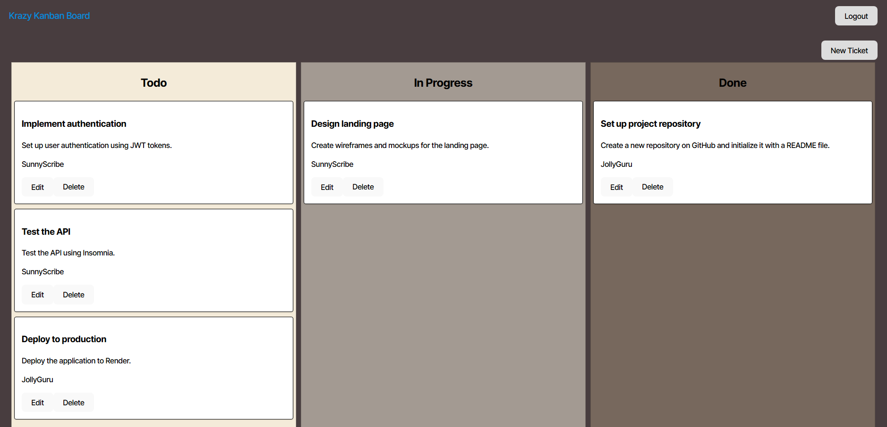
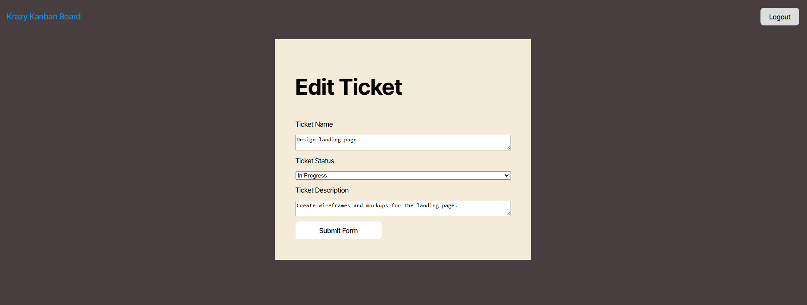
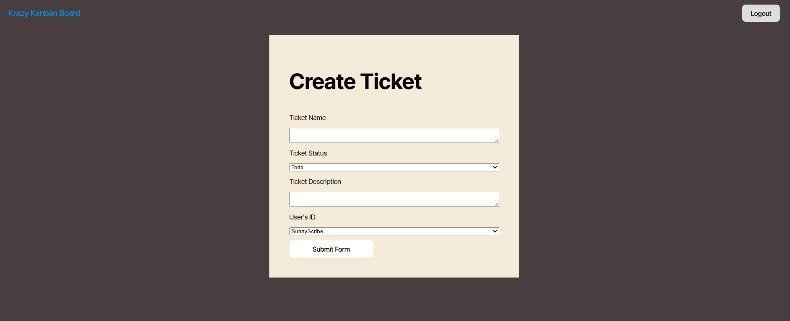

# Kanban-Board

## Description

This is a kanban board you and your team can use to help manage your software development project.  Verified users can create tickets, edit tickets, delete tickets.

## Usage

Deployed: [https://kanban-board-teon.onrender.com/](https://kanban-board-teon.onrender.com/)

Login using your username and password.

From the home screen, you can manage all tasks.  Delete a ticket by pressing the delete button on the ticket.

Press the Edit button a ticket to modify any of its properties.

Create a new ticket by clicking the New Ticket button on the home screen.

## Questions

GitHub: [cablej02](https://github.com/cablej02)

If you have additional questions, please contact me by email at [cablej02@gmail.com](mailto:cablej02@gmail.com)
